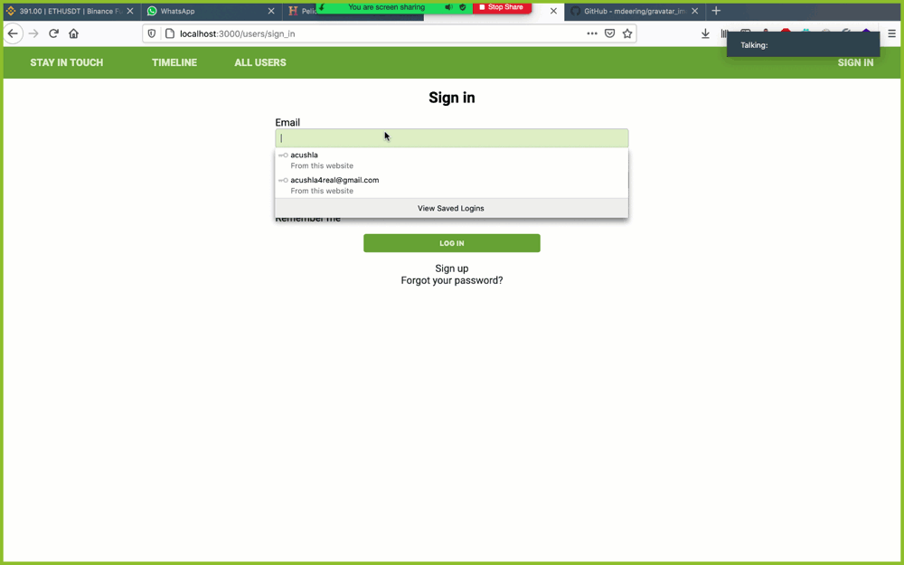

# Social Media App with Ruby on Rails

> In this pwe developed a fully fleshed out social media application from modelling the entity relationship diagram (ERD) to building the needed ActiveRecords.

Some of the advanced concepts explored in this project includes.
- Working with advanced associations, many-to-many relationships.
- Using RSpec testing using shoulda-matchers and capybara



## Built With

- Ruby v2.7.0
- Ruby on Rails v5.2.4
- RSpec

## Live Demo

[Live Demo](https://ror-social.herokuapp.com/)


## Getting Started

To get a local copy up and running follow these simple example steps.

### Prerequisites

Ruby: 2.6.3
Rails: 5.2.3
Postgres: >=9.5

### Setup

~~~bash

$ git clone https://github.com/acushlakoncept/ror-social-scaffold.git
$ cd ror-social-scaffold
~~~

Install gems with:

```
bundle install
```

Setup database with:

> make sure you have postgress sql installed and running on your system

```
   rails db:create
   rails db:migrate
```

### Usage

Start server with:

```
    rails server
```

Open `http://localhost:3000/` in your browser.

### Run tests

```
    rpsec 
```

# Authors

👤 **Somoye**

- Github:[@somoye123](https://github.com/somoye123)
- Twitter:[@ayotunde_197](https://twitter.com/ayotunde_197)
- LinkedIn:[Somoye Ayotunde](https://www.linkedin.com/in/somoye-ayotunde-03a471161)


👤 **Uduak Essien**

- Github: [@acushlakoncept](https://github.com/acushlakoncept/)
- Twitter: [@acushlakoncept](https://twitter.com/acushlakoncept)
- Linkedin: [acushlakoncept](https://www.linkedin.com/in/acushlakoncept/)


## 🤝 Contributing

Contributions, issues and feature requests are welcome!

Feel free to check the [issues page](issues/).

## Show your support

Give a ⭐️ if you like this project!

## Acknowledgments

- Microverse TSE members who reviewed and gave us positive feedbacks and guidance.
- Microverse


